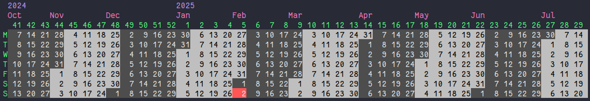

# Weeks

ncal version that works for me.

## Install

```
cargo install weeks
```

## Run

```
weeks
```

or for an interactive mode

```
weeks -i
```

Use left and right arrow keys to move the backwards and forwards.
